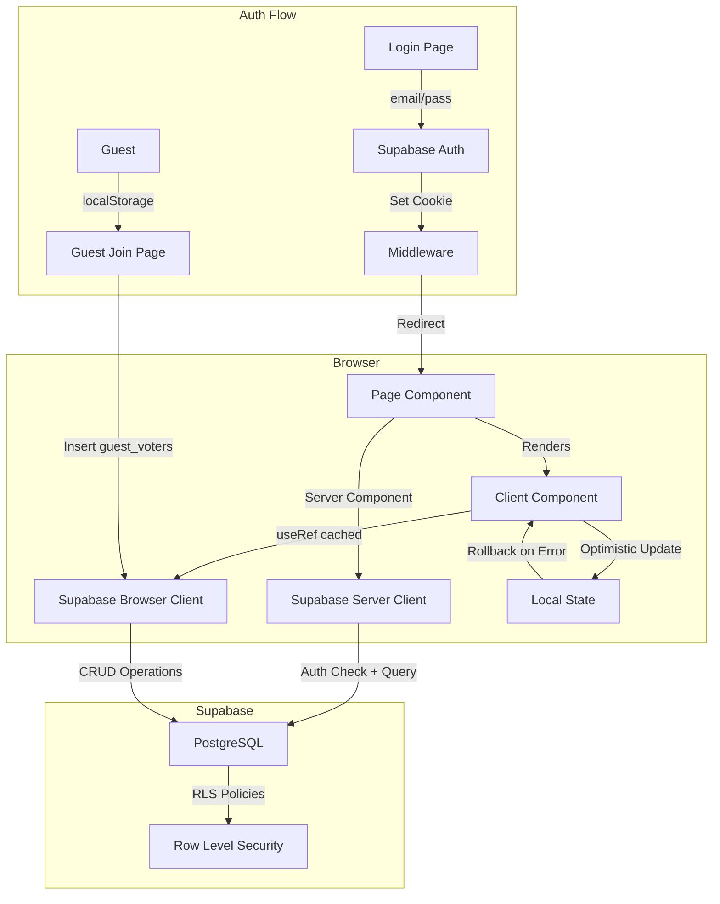
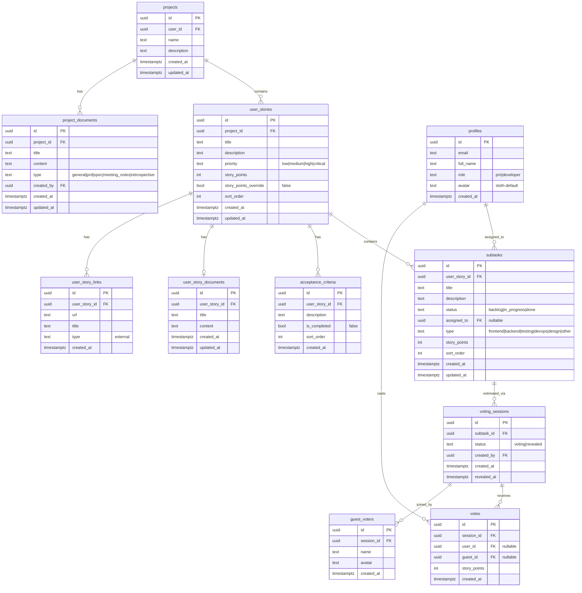
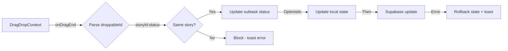

# SlothFlow - Arquitectura y Diseno

> **Ultima actualizacion:** 2026-02-09

## Stack Tecnologico

| Capa | Tecnologia | Version |
|------|-----------|---------|
| Framework | Next.js (App Router) | 14.2.35 |
| Runtime | React | 18.3.1 |
| Lenguaje | TypeScript | 5.9.3 |
| Base de datos | Supabase (PostgreSQL) | Cloud |
| Auth | Supabase Auth (SSR) | @supabase/ssr 0.8 |
| UI Components | shadcn/ui (Radix) | 14 componentes |
| Styling | Tailwind CSS | 3.4.19 |
| Animaciones | Framer Motion + Tailwind Animate | 12.30 / 1.0.7 |
| Rich Text Editor | TipTap | 3.19.0 |
| Drag & Drop | @hello-pangea/dnd | 18.0.1 |
| Markdown | react-markdown + remark-gfm | 10.1.0 / 4.0.1 |
| Notificaciones | Sonner | 2.0.7 |
| Iconos | Lucide React | 0.563.0 |

## Estructura de Carpetas

```
SlothFlow/
├── app/                          # Next.js App Router
│   ├── layout.tsx                # Root layout (fonts, Toaster)
│   ├── page.tsx                  # Landing / redirect
│   ├── globals.css               # CSS variables + tailwind base
│   ├── auth/
│   │   ├── callback/             # OAuth/email callback
│   │   └── reset-password/       # Reset password form
│   ├── login/                    # Login page
│   ├── profile/                  # Perfil de usuario
│   └── projects/
│       ├── page.tsx              # Lista de proyectos
│       └── [id]/
│           ├── page.tsx          # Detalle proyecto (Kanban + Docs tabs)
│           ├── documents/        # CRUD documentos de proyecto
│           │   ├── [documentId]/
│           │   │   ├── page.tsx + DocumentView.tsx
│           │   │   └── edit/
│           │   └── new/
│           ├── stories/          # Documentos de HU
│           │   └── [storyId]/
│           │       └── document/
│           │           ├── page.tsx + StoryDocumentView.tsx
│           │           ├── new/
│           │           └── edit/
│           └── voting/
│               └── [sessionId]/
│                   ├── page.tsx  # Sesion de votacion
│                   └── join/     # Guest join page
├── components/
│   ├── KanbanBoard.tsx           # Board principal (container)
│   ├── UserStorySection.tsx      # Seccion colapsable de HU
│   ├── SubtaskColumn.tsx         # Columna de status (droppable)
│   ├── SubtaskCard.tsx           # Tarjeta draggable
│   ├── UserStoryModal.tsx        # Modal CRUD HU
│   ├── SubtaskModal.tsx          # Modal CRUD subtarea
│   ├── Logo.tsx                  # Logo + LogoWithText
│   ├── SlothLoader.tsx           # Loaders tematicos
│   ├── UserMenu.tsx              # Dropdown de usuario
│   ├── SlothAvatarSelector.tsx   # Selector + Display de avatares
│   ├── DragDropWrapper.tsx       # Hydration-safe DnD wrapper
│   ├── documents/
│   │   ├── DocumentCard.tsx      # Card de documento
│   │   ├── DocumentsList.tsx     # Lista con busqueda/filtro
│   │   ├── MarkdownEditor.tsx    # TipTap editor
│   │   └── MarkdownViewer.tsx    # Renderer HTML/Markdown
│   └── ui/                       # shadcn/ui primitives (14)
│       ├── alert-dialog.tsx
│       ├── avatar.tsx
│       ├── badge.tsx
│       ├── button.tsx
│       ├── card.tsx
│       ├── checkbox.tsx
│       ├── dialog.tsx
│       ├── dropdown-menu.tsx
│       ├── input.tsx
│       ├── label.tsx
│       ├── scroll-area.tsx
│       ├── select.tsx
│       ├── separator.tsx
│       └── tabs.tsx
├── lib/
│   ├── types.ts                  # Tipos, interfaces, constantes
│   ├── supabase.ts               # Cliente browser (createClient)
│   ├── supabase-server.ts        # Cliente server (createServerSupabaseClient)
│   ├── utils.ts                  # cn() utility
│   └── document-templates.ts     # Templates por tipo de documento
├── middleware.ts                  # Auth middleware + rutas publicas
├── public/
│   └── avatars/                  # 8 PNG de avatares sloth
├── supabase/
│   └── migrations/               # SQL migrations
└── package.json
```

## Flujo de Datos



## Database Schema



## State Management

No hay estado global. Cada componente maneja su propio estado local:

| Componente | Estado | Patron |
|-----------|--------|--------|
| KanbanBoard | userStories, subtasks, acceptanceCriteria, expandedStories (Set) | useState + optimistic updates |
| UserStoryModal | Form fields + criteria, links, document | useState + useEffect on open |
| SubtaskModal | Form fields | useState + useEffect on open |
| Voting Page | session, votes, subtask, userStory | useState + Supabase realtime subscription |
| DocumentsList | documents, search, filter | useState + lazy load |

**Patron de Supabase Client:**
```typescript
const supabaseRef = useRef<SupabaseClient | null>(null)
const getSupabase = () => {
  if (!supabaseRef.current) {
    supabaseRef.current = createClient()
  }
  return supabaseRef.current
}
```

## Drag & Drop Architecture



**Droppable ID Format:** `{userStoryId}:{status}`
- Ejemplo: `a1b2c3d4:in_progress`
- Se parsea con `droppableId.split(':')`

## Tema Visual

**Paleta custom (tailwind.config.ts):**
- `sloth-*`: Verde organico principal (#72865e base)
- `moss-*`: Verde musgo (#5a7f59 base) - botones, acentos
- `earth-*`: Marron tierra (#b37d5c base) - fondos calidos

**Gradientes CSS:**
- `bg-organic-gradient`: Fondo de pagina
- `bg-moss-gradient`: Botones primarios

**Fonts:**
- `font-sans`: var(--font-sans) - texto general
- `font-display`: var(--font-display) - titulos y headings

**Animaciones custom (9):**
- fade-in, fade-in-up, slide-in-right/left
- float, gentle-sway, pulse-soft
- scale-in, card-hover
