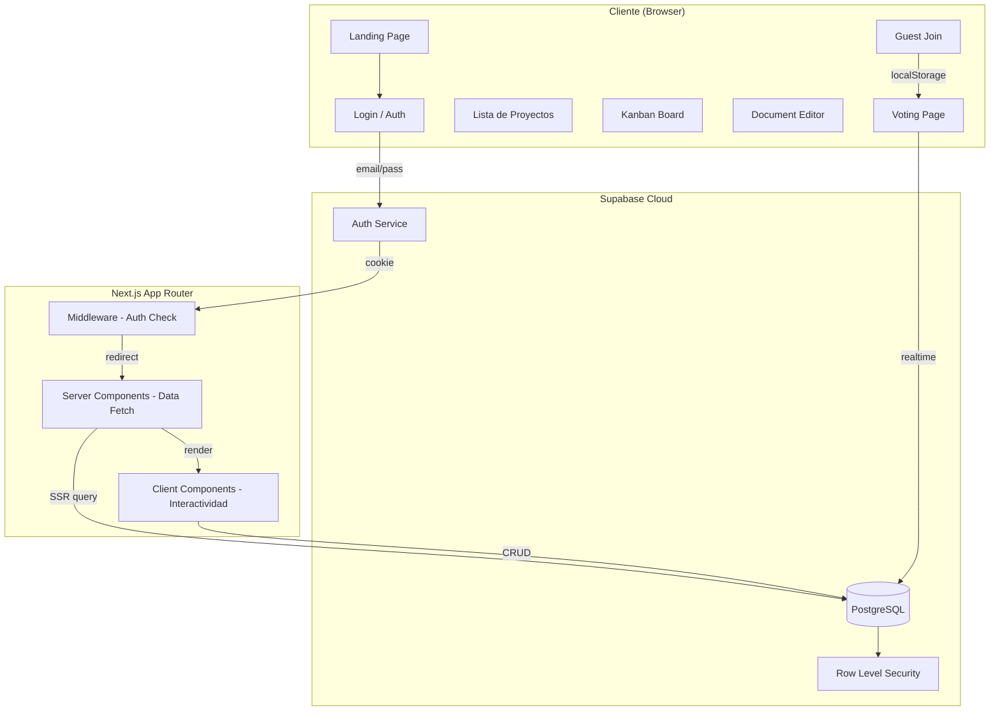
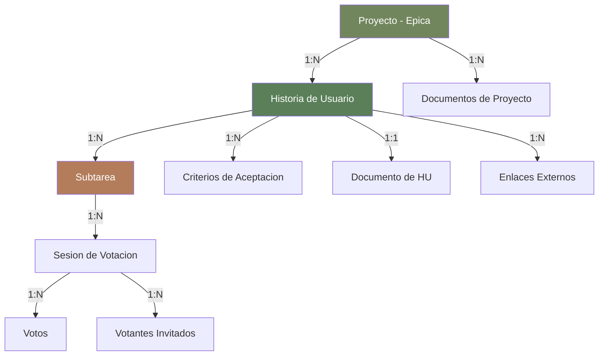
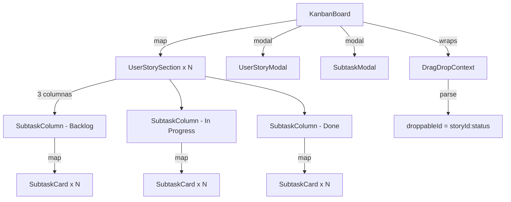
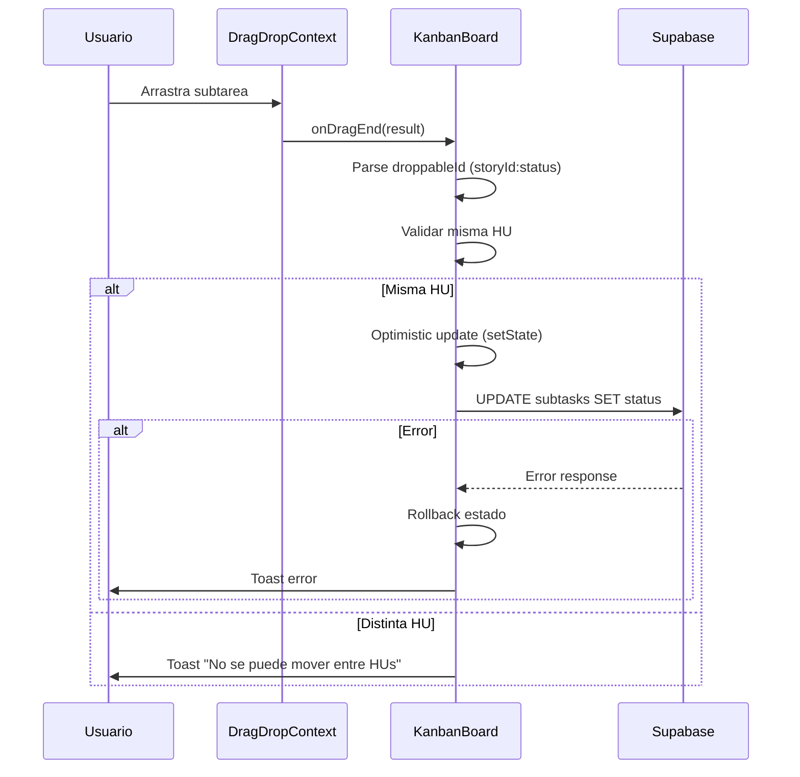
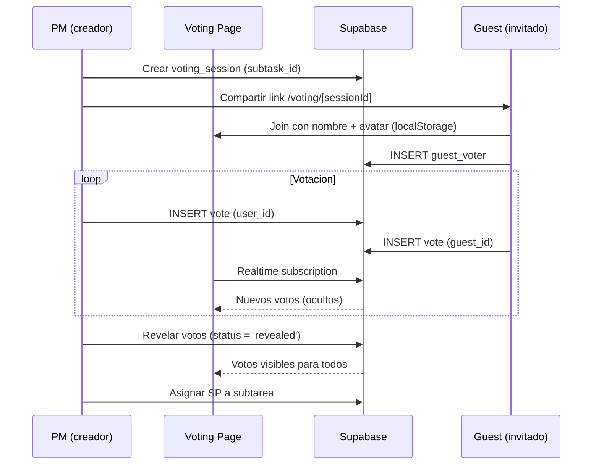
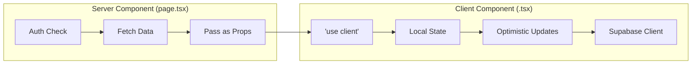

# SlothFlow - Arquitectura

## Vista General



## Jerarquia de Datos (3 niveles)



| Nivel | Entidad | Proposito |
|-------|---------|-----------|
| 1 | **Proyecto (Epica)** | Contenedor principal con documentacion |
| 2 | **Historia de Usuario** | Valor de negocio, prioridad, criterios de aceptacion |
| 3 | **Subtarea** | Trabajo tecnico, arrastrable en kanban, estimable via Planning Poker |

## Componentes Principales

### Kanban Board



- **KanbanBoard**: Componente contenedor. Maneja estado de HUs, subtareas, criterios. Coordina drag & drop.
- **UserStorySection**: Seccion colapsable por HU. Muestra prioridad, SP rollup, progreso, y 3 columnas internas.
- **SubtaskColumn**: Columna droppable (`{storyId}:{status}`). Renderiza tarjetas de subtareas.
- **SubtaskCard**: Tarjeta draggable. Muestra tipo, asignado, SP. Click abre SubtaskModal.

### Flujo de Drag & Drop



### Planning Poker



## Patron Server/Client



**Regla**: Las pages (`page.tsx`) son Server Components que verifican auth y hacen el fetch inicial. Los componentes interactivos (`KanbanBoard`, modals, etc.) son Client Components con `'use client'`.

**Patron de Supabase Client:**
```typescript
// Server: se crea por request
const supabase = await createServerSupabaseClient()

// Client: se cachea en useRef
const supabaseRef = useRef<SupabaseClient | null>(null)
const getSupabase = () => {
  if (!supabaseRef.current) {
    supabaseRef.current = createClient()
  }
  return supabaseRef.current
}
```

## Seguridad

- **Middleware** (`middleware.ts`): Intercepta todas las rutas. Redirige a `/login` si no hay sesion, excepto rutas de voting (acceso guest).
- **RLS (Row Level Security)**: Todas las tablas tienen policies. SELECT es publico (para guest voting), INSERT/UPDATE/DELETE requiere `auth.uid()`.
- **Guest voting**: Los invitados se identifican via `localStorage` (guest_id + nombre + avatar). No necesitan cuenta.

## Tema Visual

Paleta organica custom definida en `tailwind.config.ts`:

| Color | Hex base | Uso |
|-------|---------|-----|
| `sloth` | #72865e | Verde organico principal |
| `moss` | #5a7f59 | Botones, acentos, CTA |
| `earth` | #b37d5c | Fondos calidos, badges |

Fonts: `font-sans` para texto general, `font-display` para titulos.

9 animaciones custom: fade-in, slide-in, float, gentle-sway, scale-in, card-hover, etc.
